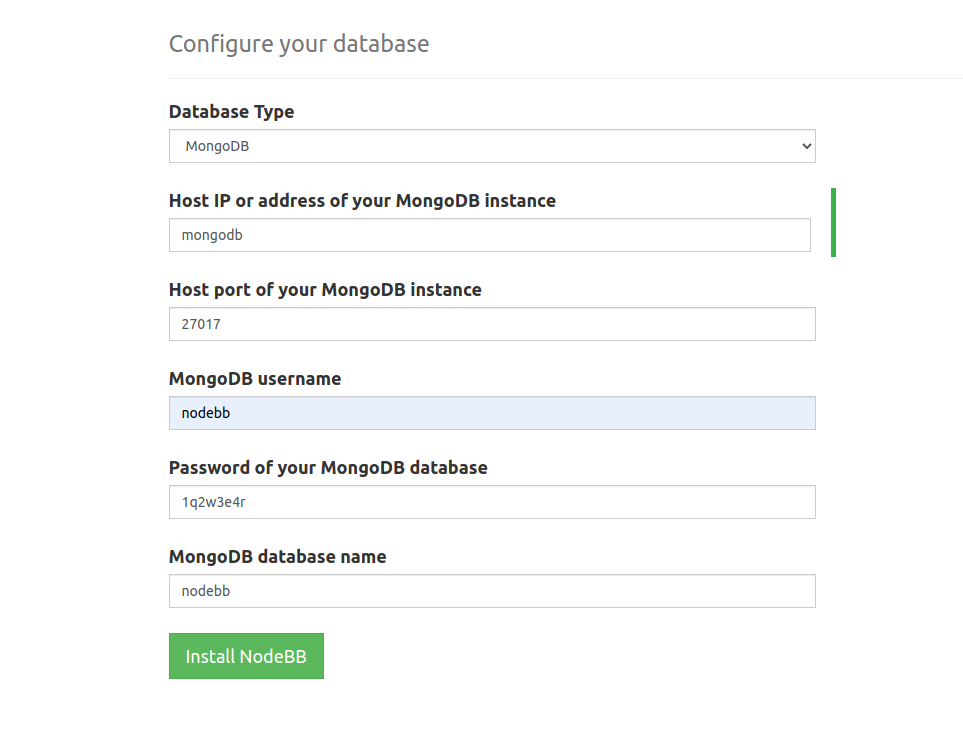

# nodebb-docker
Dockerized NodeBB, composed with mongo.

Inspired heavily from [nilsramsperger/docker-nodebb](https://github.com/nilsramsperger/docker-nodebb)

## Setup

1) Edit `.env` to set your mongo password. This will be used for both admin and nodebb users.

2) Run `docker-compose up` to start the nodebb web installer. Go to :4567 and finish the web install. Host IP should be `mongodb`, not `127.0.0.1`.

Example parameters for the database:

3) Nodebb should be running so you're good to go. Next time you run `docker-compose up`, it'll skip the web installer and just launch nodebb.

I'd also recommend to use a proxy like caddy or nginx, and set up backups for the 3 volumes in docker-compose.

## TODO: FusionAuth
